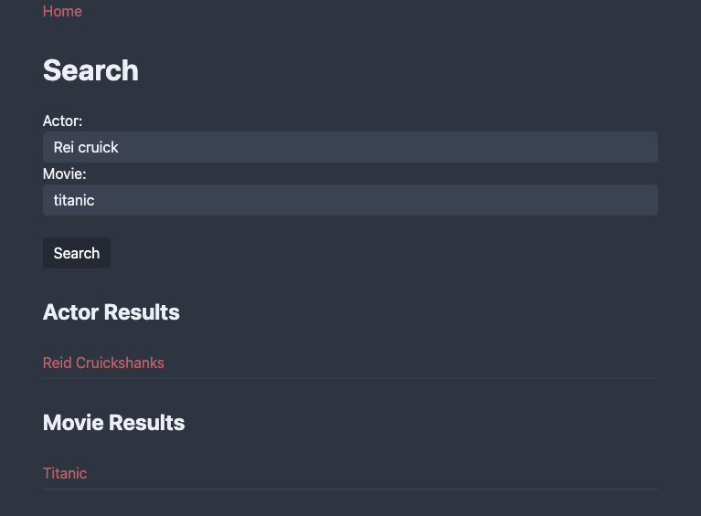
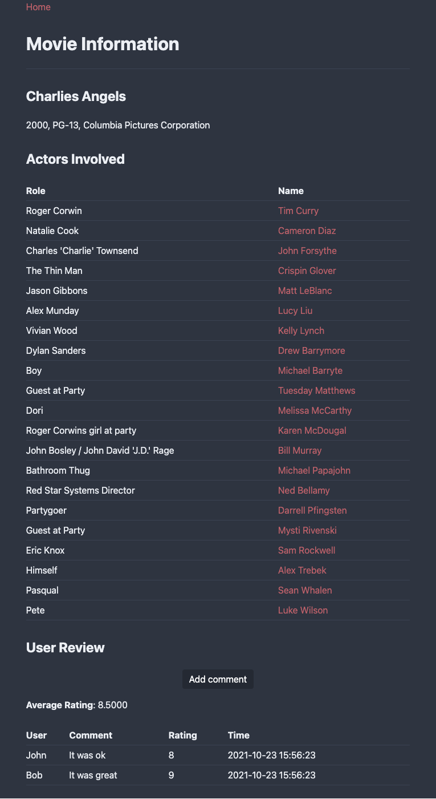

# Movie Database Website

The aim of this project is to create a fully functioning Movie Database with PHP, the Apache Web server, and MySQL (MariaDB).

## Setup
Replace `your_shared_dir` with a directory on your local machine that will be linked to `/home/cs143/shared/` in the Docker container.
```console
$ docker container rm mysql-apache
$ docker run -it -v {your_shared_dir}:/home/cs143/shared -p 8888:80 --name mysql-apache junghoo/mysql-apache
```
After creating the container, run with
```console
$ docker start -i mysql-apache
```
In your container, git clone this repository into your shared directory, then remove the `~/www/` folder and its contents and symlink a new `~/www/` folder to the cloned git repo. E.g.
```console
$ cd ~/shared/
$ git clone https://github.com/ajpfahnl/movie-database-website.git
$ cd ../
$ rm -rf www/
$ ln -s shared/movie-database-website/ www
```
Then go to [http://localhost:8888/](http://localhost:8888/) on your local machine and the website should be up and running.

## Preview

The following is an example search:



The following is an example query for information about a movie:


